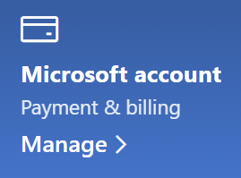

# Cambiar la información de mi cuenta de MicrosoftChange my Microsoft account information

Vaya a [https://account.microsoft.com](https://account.microsoft.com/) e inicie sesión si es necesario.Go to [https://account.microsoft.com](https://account.microsoft.com/) and sign in if necessary. Esto le llevará al panel de control de su cuenta.This will take you to your account dashboard.  

**Editar el nombre y la información personal****Edit my name and personal information**

1. En el panel de la cuenta, junto a la imagen y el nombre de la cuenta, haga clic en los tres puntos (más acciones) > Editar perfil\*\*.On your account dashboard, next to your account picture and name, click the three dots (more actions) > Edit profile\*\*.
2. En la página **Editar perfil**, utilice los vínculos provistos para cambiar la imagen de perfil, el nombre, la fecha de nacimiento, la ubicación y las preferencias de idioma de la pantalla.On the **Edit profile** page, use the links provided to change your profile picture, name, date of birth, location, and display language preference. Véase los vínculos a los perfiles de cuenta de Xbox o Skype, donde puede cambiar los detalles específicos de estas cuentas.Note the links to your Xbox or Skype account profiles, where you can change details specific to these accounts.

**Administrar direcciones de correo electrónico y números de teléfono****Manage e-mail addresses and phone numbers**

Una cuenta de Microsoft tiene una o más direcciones de correo electrónico o números de teléfono asociados a ella como "alias". Para administrarlos:A Microsoft account has one or more e-mail addresses or phone numbers associated with it as “aliases.” To manage these:

1. En el panel de la cuenta, junto a la imagen y el nombre de la cuenta, haga clic en los tres puntos (más acciones) > **Editar perfil**.On your account dashboard, next to your account picture and name, click the three dots (more actions) > **Edit profile**.
2. En la página **Editar perfil**, haga clic en **Administrar cómo iniciar sesión en Microsoft**.On the **Edit profile** page, click **Manage how you sign in to Microsoft**. 
3. Verá una lista de alias de cuenta y podrá administrar la lista, incluida la opción de agregar y eliminar direcciones de correo electrónico y números de teléfono.You will see a list of account aliases, and you can manage the list, including adding and deleting e-mail addresses and phone numbers. Aquí también puede seleccionar qué alias se pueden usar para iniciar sesión en la cuenta y cuál será el alias "principal", que se mostrará en sus dispositivos con Windows 10.Here you can also select which aliases can be used to sign in to the account, and which alias is considered “primary,” which will be displayed on your Windows 10 devices.

**Administrar métodos de pago, así como el nombre y la dirección de facturación****Manage payment methods, as well as name and address for billing** 

1. En el panel de la cuenta, junto a la imagen y el nombre de la cuenta, haga clic en los tres puntos (más acciones) > **Editar perfil**.On your account dashboard, next to your account picture and name, click the three dots (more actions) > **Edit profile**.
2. En **Pago y facturación**, haga clic en **Administrar**.Under **Payment & billing** click **Manage**.

    

3. Aquí puede agregar, editar y quitar métodos de pago y las direcciones de facturación asociadas.Here you can add, edit, and remove payment methods and their associated billing addresses. 
