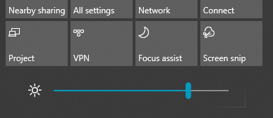

# Cambiar el brillo de la pantalla en Windows 10Change screen brightness in Windows 10

Si la versión de Windows 10 es más nueva que la 1903, tiene un **control deslizante de brillo** en el centro de actividades.If your Windows 10 is newer than version 1903, it has a **Brightness slider** in the action center. Para abrir el centro de actividades, haga clic en el botón **Notificación** situado en el extremo derecho de la barra de tareas, o pulse **Inicio de Windows + A** en el teclado.To open the action center, click the **Notification** button at the rightmost side of your taskbar, or press **Windows home + A** on your keyboard.

Si su Windows 10 es una versión anterior, puede buscar el control deslizante de brillo yendo a **[Configuración > Sistema > Pantalla](ms-settings:display?activationSource=GetHelp)**.If your Windows 10 is an earlier version, you can find the brightness slider by going to **[Settings > System > Display](ms-settings:display?activationSource=GetHelp)**.

**Notas**:**Notes**:

- Es posible que no vea el cambio de brillo del control deslizante de pantalla integrado en los equipos de escritorio que tienen un monitor externo.You might not see the Change brightness for the built-in display slider on desktop PCs that have an external monitor. Para cambiar el brillo de un monitor externo, utilice los controles del monitor.To change the brightness of an external monitor, use the controls on the monitor.
- Si no tiene un equipo de escritorio y el control deslizante no aparece o no funciona, intente actualizar el controlador de pantalla.If you don't have a desktop PC and the slider doesn't appear or work, try updating the display driver. En el cuadro de búsqueda de la barra de tareas, escriba **Administrador de dispositivos** y, después, seleccione **Administrador de dispositivos** de la lista de resultados.In the search box on the taskbar, type **Device Manager**, and then select **Device Manager** from the list of results. En **Administrador de dispositivos**, seleccione **Adaptadores de pantalla** y seleccione el adaptador de pantalla.In **Device Manager**, select **Display adapters**, then select the display adapter. Mantenga presionado (o haga clic con el botón derecho) en el nombre del adaptador de pantalla y haga clic en **Actualizar controlador**. Después, siga las instrucciones.Press and hold (or right-click) the display adapter name and click **Update driver**; then follow the instructions.
