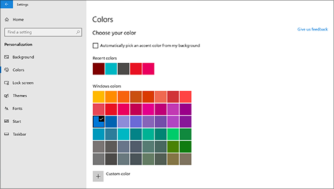
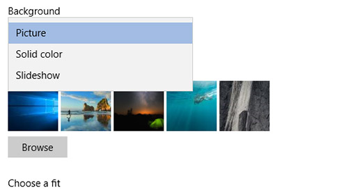

# Cambiar el fondo y los colores del escritorioChange your desktop background and colors

Para cambiar la configuración de colores, ve a Inicio Configuración Colores de  >    >  **personalización** y, a continuación, elige tu propio color o deja que Windows extraiga un color de acento  >  de tu fondo.To change your colors setting, go to **Start** > **Settings** > **Personalization** > **Colors**, and then choose your own color or let Windows pull an accent color from your background.

Para cambiar el fondo del escritorio, ve a Inicio Configuración Fondo de  >    >  **personalización**  >  y, a continuación, elige una imagen, un color sólido o crea una presentación de imágenes.To change your desktop background, go to **Start** > **Settings** > **Personalization** > **Background**, and then choose a picture, solid color, or create a slideshow of pictures. 

¿Desea más fondos de escritorio y colores?Want more desktop backgrounds and colors? Visita [Microsoft Store para](https://www.microsoft.com/store/collections/windowsthemes) elegir entre decenas de temas gratuitos.Visit [Microsoft Store](https://www.microsoft.com/store/collections/windowsthemes) to choose from dozens of free themes.
