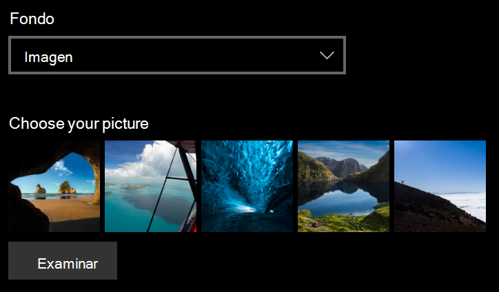
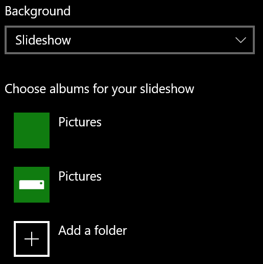

# Cambiar el fondo de la pantalla de bloqueoChange your lock screen background

- Vaya a **Settings**la pantalla de bloqueo de  >  **Personalización**de configuración  >  **Lock screen**.Go to **Settings** > **Personalization** > **Lock screen**. O haga clic o pulse [aquí](ms-settings:lockscreen?activationSource=GetHelp).Or click or tap [here](ms-settings:lockscreen?activationSource=GetHelp).

- Para establecer una imagen de fondo personalizada, seleccione **imagen** en la lista desplegable **fondo** y elija o **vaya** a la imagen.To set a custom background picture, select **Picture** from the **Background** drop-down list, and choose or **Browse** to the picture.

  

- Para configurar una presentación de imágenes personalizadas, seleccione **presentación** en la lista desplegable **fondo** y elija un álbum o agregue una carpeta que contenga las imágenes de la presentación.To set up a slideshow of custom pictures, select **Slideshow** from the **Background** drop-down list, and choose an album or add a folder that contains the pictures for the slideshow.

  
