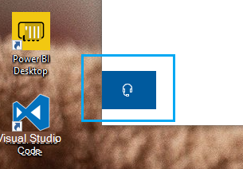

# Póngase en contacto con nosotros haciendo clic en el botón de auriculares

Si quieres ponerse en contacto con el Soporte técnico de Microsoft, haz clic en Póngase **en** contacto con nosotros en la esquina inferior izquierda de esta aplicación. Dentro de la ventana desplegable, se te guiará al canal de soporte técnico correcto después de elegir tu producto y categoría de problema.

Puedes seguir interactuando con el resto de la aplicación incluso después de iniciar una sesión de Contacto. El panel Póngase en contacto con nosotros se puede minimizar temporalmente haciendo clic en cualquier otro lugar dentro de la aplicación. Para volver a la misma sesión, simplemente haga clic **en Póngase en contacto con** nosotros de nuevo.
