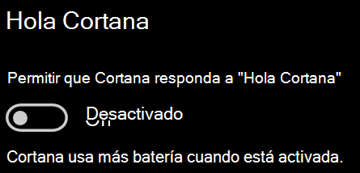

# Cortana no me habla o no me escuchaCortana doesn’t talk to me or can’t hear me

Si intenta usar la característica "Hola Cortana", que le permite comunicarse con Cortana sin seleccionar el botón de Cortana en la barra de tareas o el botón del micrófono en el panel de Cortana, confirme que la característica está habilitada:If you are trying to use the "Hey Cortana" feature, which allows you to talk to Cortana without selecting the Cortana button on the taskbar or the microphone button in the Cortana panel, confirm that the feature is enabled:

1. Vaya a **Inicio** y seleccione **[Configuración > Cortana](ms-settings:cortana?activationSource=GetHelp)**.Go to **Start**, then select **[Settings > Cortana](ms-settings:cortana?activationSource=GetHelp)**.
2. En **Hola Cortana**, cambie el conmutador **Permitir a Cortana responder cuando digas "Hola Cortana"** a **Activado**.Under **Hey Cortana**, switch the **Let Cortana respond to "Hey Cortana"** toggle to **On**.

**¿Su configuración de privacidad impide que Cortana le escuche?****Are your privacy settings preventing Cortana from hearing you?**

La configuración de privacidad puede impedir que Cortana responda a su voz.Your privacy settings can prevent Cortana from responding to your voice.
- Asegúrese de que el reconocimiento de voz en línea está activado:Check to make sure Online Speech recognition is turned on:
    - Vaya a **Inicio** y haga clic en **[Configuración > Privacidad > Voz](ms-settings:privacy-speech?activationSource=GetHelp)**.Go to **Start**, then click **[Settings > Privacy > Speech](ms-settings:privacy-speech?activationSource=GetHelp)**.
    - En **Reconocimiento de voz en línea**, cambie la configuración a **Activado**.Under **Online speech recognition**, switch the setting to **On**.
- Asegúrese de que Cortana tiene permiso para acceder al micrófono.Check to make sure Cortana has permission to access your microphone. 
    - Vaya a Inicio y haga clic en **[Configuración > Privacidad > Micrófono](ms-settings:privacy-microphone?activationSource=GetHelp)**.Go to Start, then click **[Settings > Privacy > Microphone](ms-settings:privacy-microphone?activationSource=GetHelp)**.
    - En **Elegir qué aplicaciones pueden acceder al micrófono**, busque **Cortana** en la lista de aplicaciones y servicios, y asegúrese de que el conmutador está en **Activado**.Under **Choose which apps can access your microphone**, look for **Cortana** within the list of apps and services and make sure the switch is toggled to **On**.

Además, asegúrese de que los altavoces o micrófonos estén encendidos y en funcionamiento para hablar con Cortana.Moreover, please also make sure that your speakers or microphones are up and working in order to talk to Cortana.
