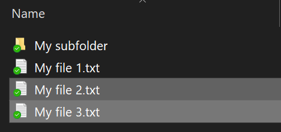
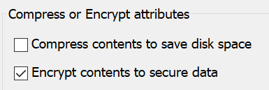

# Cifrar archivos o carpetas en Windows 10

Si lo desea, puede cifrar todo un disco con BitLocker, pero si solo necesita cifrar carpetas y archivos individuales (y su contenido):

1. En **Explorador de archivos**, seleccione los archivos que desee cifrar. En este ejemplo, se han seleccionado dos archivos:

    

2. Haga clic con el botón derecho en los archivos seleccionados y, luego, haga clic en **Propiedades**.

3. En la ventana de **Propiedades**, haga clic en **Avanzado**.

4. En la ventana **Propiedades avanzadas**, active la casilla de verificación **Cifrar contenido para proteger datos**:

    

5. Haga clic en **Aceptar**.
