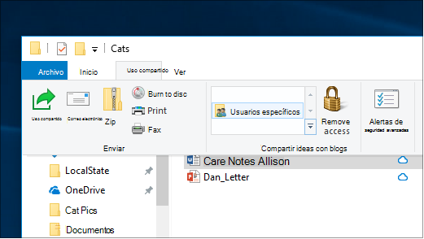
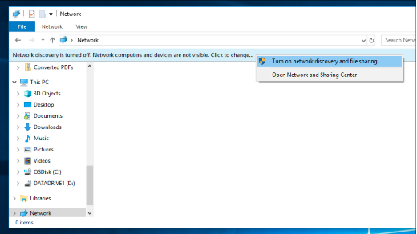

# Uso compartido de archivos a través de una red en Windows 10

**Nota:** Si anteriormente usaste HomeGroup para compartir archivos, ten en cuenta que HomeGroup se ha quitado de Windows 10 (versión 1803). Ahora puedes compartir impresoras y archivos mediante características integradas en Windows 10.

**Para compartir archivos o carpetas a través de una red**

- En **el Explorador de** archivos, seleccione  un archivo > haga clic en la pestaña Compartir en la parte superior > en la sección Compartir **con,** haga clic **en Personas específicas**.

    
          
- Si selecciona varios archivos a la vez, puede compartirlos todos de la misma manera. También funciona para carpetas.

**Para ver dispositivos en la red que comparten archivos**

- En **el Explorador de** archivos, vaya a **Red**. Si la detección de red no está habilitada, verá un mensaje de error "La detección de red está desactivada..."

- Haga clic en **el banner Detección de** red desactivado y, a continuación, haga clic en Activar la detección de red y el uso compartido de **archivos.**

    

[Más información sobre el uso compartido de archivos en una red](https://support.microsoft.com/help/4092694/windows-10-file-sharing-over-a-network)

[Compartir archivos con aplicaciones, OneDrive, correos electrónicos y mucho más](https://support.microsoft.com/help/4027674/windows-10-share-files-in-file-explorer)
