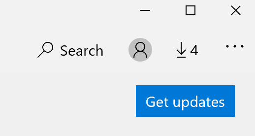

# Corregir el idioma para mostrar de las aplicaciones

Después de cambiar el idioma de presentación en Windows 10, es posible que algunas aplicaciones aún usen el idioma anterior al abrirlos. Esto sucede porque las nuevas versiones de las aplicaciones para ese idioma deben descargarse de la Tienda. Para solucionar este problema, puedes esperar la actualización automática o puedes instalar manualmente la versión actualizada de las aplicaciones.

Para instalar manualmente la actualización, abra **Microsoft Store** y haga clic en Descargas **y actualizaciones** en la esquina superior derecha. A continuación, **haga clic en Obtener actualizaciones**. Si el idioma no se cambia una vez completada la actualización, intente reiniciar el equipo.

Para obtener más información sobre la configuración de idioma de entrada y presentación, consulta Administrar la configuración de idioma de entrada y [presentación en Windows 10](https://support.microsoft.com/help/4027670/windows-10-add-and-switch-input-and-display-language-preferences).
