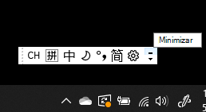
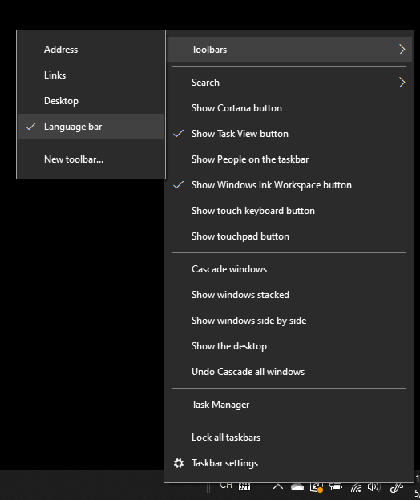
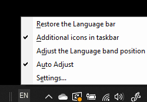

# Ocultar, mostrar o restablecer la barra de idioma

**Para minimizar la barra de idioma:**

Puede hacer clic en el botón minimizar en la esquina superior derecha de la barra de idioma. También puede arrastrar la barra de idioma a la barra de tareas, lo que la minimizará automáticamente.

**Para mostrar la barra de idioma:**

Si no quiere acoplar la barra de idioma a la barra de tareas, haga clic con el botón derecho en cualquier espacio vacío de la barra de tareas y desactive la casilla **Barra de idioma** en el menú Barras de herramientas. De este modo, la barra de idioma se mostrará fuera de la barra de tareas, de la misma manera que en la captura de pantalla anterior.

**Para restaurar la barra de idioma a los ajustes predeterminados:**

Haga clic con el botón derecho en el botón idioma en la barra de herramientas y haga clic en **Restaurar la barra de idioma** en el menú. De este modo, se restaurará a los ajustes predeterminados.

