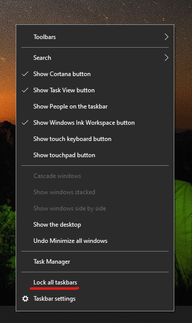

# Mover la barra de tareas a un lado o a la parte superior del escritorioMove the taskbar to either side or the top of your desktop

En primer lugar, compruebe que la barra de tareas está desbloqueada.First, please confirm that the taskbar is unlocked. Para averiguar si está desbloqueada, haga clic con el botón derecho en cualquier espacio vacío de la barra de tareas y compruebe si **Bloquear la barra de tareas** tiene una marca de verificación al lado.To find out whether yours is unlocked, right-click any empty space on the taskbar and see whether **Lock the taskbar** has a checkmark next to it. Si hay una marca de verificación, la barra de tareas estará bloqueada y no se podrá mover.If there is a checkmark, the taskbar is locked and cannot be moved. Si hace clic en **Bloquear la barra de tareas**, ésta se desbloquea y se elimina la marca de verificación.Clicking **Lock the taskbar** once will unlock it and remove the checkmark.

Si tiene varios monitores que muestran la barra de tareas, verá **Bloquear todas las barras de tareas**.If you have multiple monitors that display the taskbar, you will see **Lock all taskbars**.

Cuando se desbloquee la barra de tareas, puede pulsar y mantener pulsado un lugar en el espacio vacío de la barra de tareas y arrastrarlo a la ubicación que desee en la pantalla.Once the taskbar is unlocked, you can press and hold any empty space on the taskbar and drag it to the location you want on the screen. También puede hacer clic con el botón derecho en cualquier espacio vacío de la barra de tareas e ir a **[Configuración de la barra de tareas](ms-settings:taskbar?activationSource=GetHelp) > Ubicación de la barra de tareas en la pantalla**.You can also do so by right-clicking on any empty space on the taskbar and go to **[Taskbar settings](ms-settings:taskbar?activationSource=GetHelp) > Taskbar location on screen**.
