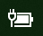

# El icono de batería o de energía no se encuentra en Windows 10Power or battery icon missing in Windows 10

Si su dispositivo con Windows 10 tiene una batería (por ejemplo, un portátil o tableta, o un equipo conectado mediante USB a un sistema de alimentación ininterrumpida), normalmente se mostrará un icono de batería o de energía en la barra de tareas cerca del reloj, por ejemplo:If your Windows 10 device has a battery (e.g., laptop or tablet, or a PC connected via USB to a UPS), normally a power/battery icon is shown in the taskbar near the clock, for example:

Si no ve este icono, es posible que esté oculto:If you don't see this icon, it may be hidden:

1. Vaya a **[Configuración > Personalización > Barra de tareas](ms-settings:taskbar?activationSource=GetHelp)**.Go to **[Settings > Personalization > Taskbar](ms-settings:taskbar?activationSource=GetHelp)**.

2. En el área de Notificaciones, haga clic en **Seleccionar los iconos que aparecerán en la barra de tareas**.In the Notification area, click **Select which icons appear on the taskbar**.

3. Después, busque en la lista el elemento **Energía** y cambie el valor a **Activado**.Then find the **Power** item in the list and toggle its setting to **On**.

    

**Solución de problemas****Troubleshooting**

Si ha seguido las instrucciones anteriores y el botón de alternancia **Energía** se muestra atenuado o no visible, en el cuadro de búsqueda de la barra de tareas, escriba **Administrar dispositivos** y seleccione **Administrador de dispositivos** en la lista de resultados.If you followed the above instructions and the **Power** toggle is greyed out or not visible, in the search box on the taskbar, type **device manager**, and then select **Device Manager** in the list of results. En **Baterías**, haga clic con el botón derecho en la batería del dispositivo, haga clic en **Deshabilitar** y haga clic en **Sí**.Under **Batteries**, right-click the battery for your device, click **Disable**, and click **Yes**. Espere unos segundos y haga clic con el botón derecho en la batería y haga clic en **Habilitar**.Wait a few seconds, and then right-click the battery and click **Enable**. Después reinicie el dispositivo.Then restart your device.

Si ha seguido las instrucciones anteriores, pero el icono de batería no aparece en la barra de tareas, en el cuadro de búsqueda de la barra de tareas, escriba **Administrador de tareas** y haga clic en **Administrador de tareas** en la lista de resultados.If you followed the above instructions, but the battery icon does not appear on the taskbar, in the search box on the taskbar, type **task manager**, and then click **Task Manager** in the list of results. En la pestaña **Procesos**, en **Nombre**, haga clic con el botón derecho en **Explorador** y haga clic en **Reiniciar**.  On the **Processes** tab, under **Name**, right-click **Explorer**, and then click **Restart**.
