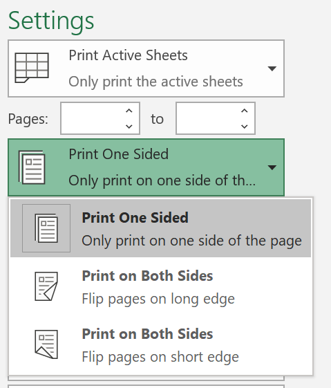
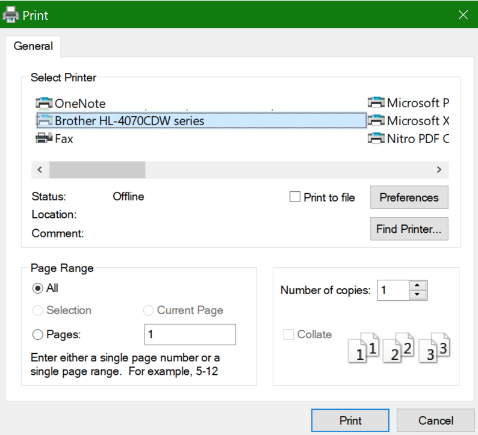

# Impresión en ambas caras del papel (impresión doble cara)

**¿Mi impresora es capaz de imprimir a doble cara?**

El resumen de características de su impresora o el manual debería decirle si es capaz de imprimir en ambas caras del papel, también conocido como "impresión doble cara". Si tiene Microsoft Office, otra forma de averiguarlo es abriendo una aplicación de Office, como Word o Excel, yendo a **archivo > Imprimir**, asegurándose de que la impresora adecuada está seleccionada, y buscando la compatibilidad en la sección de Configuración. Por ejemplo: 

** Impresión doble cara en Microsoft Office **

Si la impresora admite la impresión a doble cara, al ir al ** archivo > Imprimir**en la aplicación de Office, verá una opción para "Imprimir en ambas caras", como se muestra en el ejemplo anterior.  Seleccione el tipo de impresión de doble cara que quiera (voltee en bordes largos, o voltee sobre el borde corto) y haga clic en **Imprimir** para iniciar la copia impresa.

** Impresión a doble cara desde cualquier aplicación **

En muchas aplicaciones, cuando imprime, verá un diálogo de impresión general que se ve así: 

Asegúrese de que la impresora adecuada está seleccionada, luego haga clic en **Preferencias** para abrir la ventana preferencias de la impresora. Si la impresora es capaz de imprimir a doble cara, la capacidad de habilitarla para el trabajo de impresión actual se mostrará en esa ventana.
