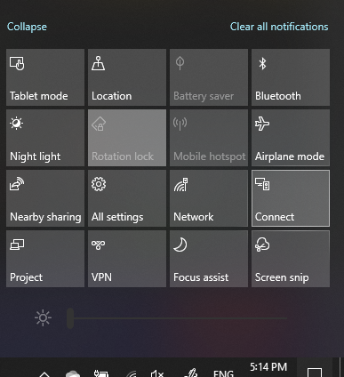

# Proyectar a un equipoProject to a PC

En el dispositivo de destino (proyectar a), busque "Configuración de proyección" para abrir la página de Configuración de **Proyectar en este equipo**.On your destination device (projecting to), search for "Projection Settings" to open the Settings page of **Projecting to this PC**. Luego, asegúrese de que:Then make sure that:
- El menú desplegable de "Algunos dispositivos Windows y Android pueden proyectar en este equipo cuando el usuario lo autorice" esté establecido en **Siempre desactivado**."Some Windows and Android devices can project to this PC when you say it's OK" drop-down menu is set to **Always Off**.
- El menú desplegable "Preguntar si se puede proyectar en este equipo" esté establecido en **Cada vez que se requiera una conexión**."Ask to project to this PC" drop-down menu is set to **Every time a connection is required**.
- El menú desplegable "Solicitar PIN de emparejamiento" esté establecido en **Nunca**."Require PIN for pairing" drop-down menu is set to **Never**.

En el dispositivo de destino, inicie la aplicación **Conectar** yendo a **Inicio** y buscando "Conectar".On your destination device, launch **Connect** app by going to **Start** and search for "Connect".

Después, en el dispositivo de origen desde el que está intentando proyectar:Then, on your source device that you are trying to project from:

1. Presione la **tecla Windows + A** para abrir el Centro de actividades.Press **Windows key + A** to open Action Center.
2. Haga clic en **Conectar**.Click **Connect**.
3. Haga clic en el dispositivo del que desea proyectar la pantalla.Click the device you want to project the screen to.

Después de seguir los pasos anteriores, es posible que el dispositivo de destino muestre la pantalla del dispositivo de origen como si fuera un monitor secundario.After the above steps, your destination device should display the screen of the source device as if it is a secondary monitor.
