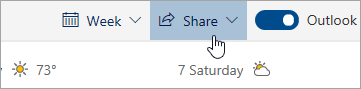

# Programar con Outlook en la WebSharing with Outlook on the web

Desde su Calendario, en la barra de herramientas de la parte superior de la página, seleccione  **Compartir** y elija el calendario que quiere compartir.From your Calendar, on the toolbar at the top of the page, select **Share**, and choose the calendar you want to share.

    

**Nota**: No puede compartir calendarios que pertenezcan a otras personas.**Note**: You can't share calendars owned by other people.

- Especifique el nombre o la dirección de correo electrónico de la persona con quien desea compartir su calendario.Enter the name or email address of the person you want to share your calendar with.
- Elija cómo quiere que esta persona use el calendario:Choose how you want the person to use your calendar:
    - **Puede ver si estoy ocupado** les permite ver cuándo está ocupado, pero no incluye detalles como la ubicación del evento.**Can view when I'm busy** lets them see when you're busy but doesn't include details like the event location.
    - **Puede ver títulos y ubicaciones** les permite ver cuándo está ocupado, así como el título y la ubicación de los eventos.**Can view titles and locations** lets them see when you're busy, as well as the title and location of events.
    - **Puede ver todos los detalles** les permite ver todos los detalles de los eventos.**Can view all details** lets them see all the details of your events.
    - **Puede editar** les permite modificar su calendario.**Can edit** lets them edit your calendar.
    - **Delegar** les permite editar el calendario y compartirlo con otras personas.**Delegate** lets them edit your calendar and share it with others.
- Seleccione **Compartir**.Select **Share**.
