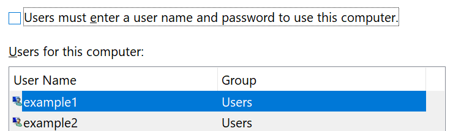

# Iniciar sesión en Windows 10 sin usar una contraseña

Para evitar tener que escribir una contraseña al inicio Windows, se recomienda usar una de las opciones de inicio de sesión seguro de Windows Hello, como un PIN, reconocimiento facial o huella digital, si está disponible. Si realmente quieres deshabilitar el inicio de sesión seguro, consulta las instrucciones "Iniciar sesión automáticamente en Windows 10" a continuación.

**Seguridad Windows Hello alternativas a la contraseña de la cuenta**

Vaya a **Configuración > cuentas > opciones de inicio** de sesión (o haga clic [aquí](ms-settings:signinoptions?activationSource=GetHelp)). Aparecerán las opciones de inicio de sesión disponibles. Por ejemplo:

Haga clic o pulse en una de las opciones para configurarla. La próxima vez que inicies o Windows, podrás usar la nueva opción en lugar de una contraseña. 

**Inicie sesión automáticamente en Windows 10**

**Nota:** El inicio de sesión automático es conveniente, pero presenta un riesgo de seguridad, especialmente si el equipo es accesible por varias personas. 

1. Haga clic o pulse en **el botón** Inicio de la barra de tareas.

2. Escriba **netplwiz** y presione la tecla Entrar para abrir la ventana Cuentas de usuario.

3. En **Cuentas de usuario,** haga clic en la cuenta en la que desea iniciar sesión automáticamente cuando Windows inicio.

4. Desactive la casilla "Los usuarios deben escribir un nombre de usuario y una contraseña para usar este equipo".

    

5. Haga clic en **Aceptar**. Se le pedirá que escriba y confirme la contraseña de la cuenta que seleccionó. Haga clic en **Aceptar** para finalizar. La próxima Windows 10 inicio, iniciará sesión automáticamente en la cuenta seleccionada.
