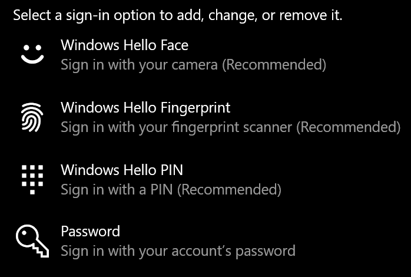
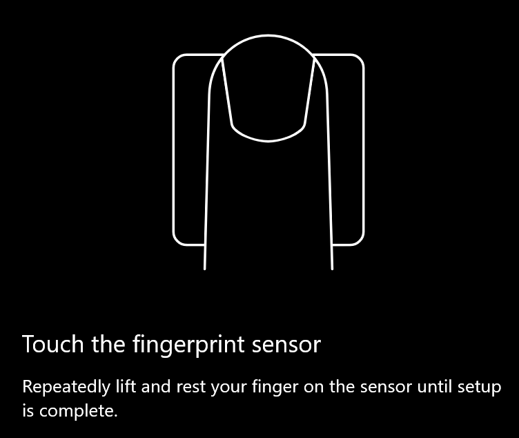
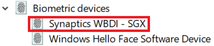

# Usar la opción de desbloqueo de huellas digitales en Windows 10Use fingerprint unlock option in Windows 10

**Habilitar huella digital de Windows Hello****Enable Windows Hello Fingerprint**

Para desbloquear Windows 10 con tu huella digital, debes configurar la huella digital de Windows Hello agregando (permitiendo que Windows aprenda a reconocer), al menos, un dedo.To unlock Windows 10 using your fingerprint, you need to set up Windows Hello Fingerprint by adding (letting Windows learn to recognize) at least one finger. 

1. Vaya a **configuración > cuentas > opciones de inicio de sesión** (o haga clic [aquí](ms-settings:signinoptions?activationSource=GetHelp)).Go to **Settings  > Accounts > Sign-in options** (or click [here](ms-settings:signinoptions?activationSource=GetHelp)). Se mostrarán las opciones de inicio de sesión disponibles.Available sign-in options will be listed. Por ejemplo:For example:

    

2. Haga clic o pulse **huella digital de Windows Hello**y, a continuación, haga clic en **configurar**.Click or tap **Windows Hello Fingerprint**, then click **Set up**. En la ventana de configuración de Windows Hello **, haga clic en introducción.**In the Windows Hello setup window, click **Get started**. El sensor de huellas digitales se activará y se le pedirá que ponga el dedo en el sensor:The fingerprint sensor will activate, and you'll be asked to place your finger on the sensor:

   

3. Sigue las instrucciones, que te pedirán que digitalices el dedo repetidamente.Follow the instructions, which will ask you to repeatedly scan your finger. Cuando termine, tendrá la opción de agregar otros dedos que quiera usar para el inicio de sesión.When this is finished, you'll have the option of adding other fingers you may want to use for sign-in. La próxima vez que inicie sesión en Windows 10, tendrá la opción de usar su huella dactilar para hacerlo.Next time you sign in to Windows 10, you will have the option of using your fingerprint to do so.

**Huella digital de Windows Hello no disponible como opción de inicio de sesión****Windows Hello Fingerprint not available as a sign-in option**

Si la huella digital de Windows Hello no se muestra como una opción en **Opciones de inicio de sesión**, significa que Windows no tiene constancia de ningún escáner o lector de huellas digitales conectado a tu PC, o que una directiva del sistema impide su uso (si, por ejemplo, el equipo está administrado por el área de trabajo).If Windows Hello Fingerprint is not shown as an option in **Sign-in options**, it means Windows is not aware of any fingerprint reader/scanner attached to your PC, or that a system policy prevents its use (if for example your PC is managed by your workplace). Para solucionar problemas:To troubleshoot: 

1. Seleccione el botón **Inicio** de la barra de tareas y busque **Administrador de dispositivos**.Select the **Start** button in the Taskbar and search for **Device Manager**.

2. Haga clic o pulse para abrir el **Administrador de dispositivos**.Click or tap to open **Device Manager**.

3. En el administrador de dispositivos, expanda dispositivos biométricos haciendo clic en su cheurón.In Device Manager, expand Biometric devices by clicking its chevron.

   

4. El escáner de huellas digitales debe aparecer como un dispositivo biométrico, como el explorador de WBDI de Synaptics:Your fingerprint scanner should be listed as a biometric device, such as the Synaptics WBDI scanner:

   

5. Si no se muestra el escáner de huellas digitales y el escáner está integrado en el equipo, ve al sitio web del fabricante del equipo.If your fingerprint scanner is not shown, and the scanner is integrated into your PC, go to the PC manufacturer's website. En la sección de soporte técnico de su modelo de equipo, busque un controlador de Windows 10 para un escáner que pueda instalar.In the technical support section for your PC model, search for a Windows 10 driver for a scanner that you can install.

6. Si el escáner es independiente del equipo (conectado a través de USB), ve al sitio web del fabricante del escáner para buscar e instalar el software de controlador de dispositivo de Windows 10 para el modelo de escáner que tienes.If the scanner is separate from the PC (attached via USB), go to the scanner manufacturer's website to find and install Windows 10 device driver software for the scanner model you have.
