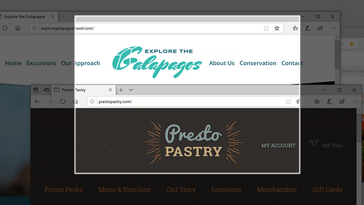
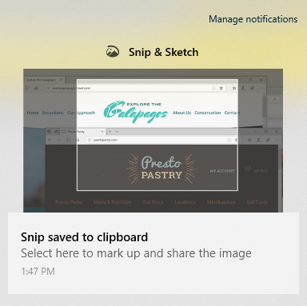

# Usar el recorte & boceto para capturar, marcar y compartir imágenesUse Snip & Sketch to capture, mark up, and share images

El boceto de la pantalla ahora se llama **recorte & esbozo**.Screen sketch is now called **Snip & Sketch**. **Para realizar rápidamente un recorte**:**To quickly take a snip**:

1. Presione la **tecla del logotipo de Windows + Mayús + S**. Verá que la pantalla es más oscura y que el cursor se muestra como una cruz.Press the **Windows logo key + Shift + S**. You'll see your screen darken and your cursor displayed as a cross. 

2. Elija un punto en el borde del área que desee copiar y haga clic con el botón primario en el cursor.Choose a point at the edge of the area you want to copy and left-click the cursor. 

3. Mueva el cursor para resaltar el área que desea capturar.Move your cursor to highlight the area you want to capture. El área que capture aparecerá en la pantalla.The area you capture will appear on your screen.

   

La imagen que recortadas se guarda en el portapapeles, lista para pegarla en un correo electrónico o documento.The image you snipped is saved to your clipboard, ready for pasting into an email or document. 

**Si desea editar o ver la imagen**:**If you want to edit or view the image**: 

- Haga clic en el icono de notificaciones en el extremo derecho de la barra de tareas; a continuación, haga clic en la imagen que acaba de capturar.Click the notifications icon at the far right side of the taskbar; then click the picture you have just captured. El recorte se abrirá en la aplicación de boceto & de recorte.Your snip opens in the Snip & Sketch app.

   
