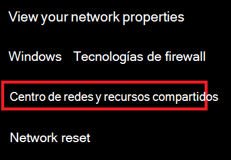
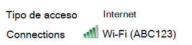
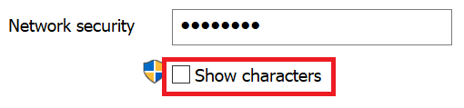

# Ver Wi-Fi de red en Windows 10View Wi-Fi network password in Windows 10

1. Asegúrate de que el equipo con Windows 10 esté conectado a la Wi-Fi red.Make sure your Windows 10 PC is connected to the Wi-Fi network.

2. Ve a **Configuración > red & Estado** de internet > ,  o haz clic o pulsa aquí para permitirnos llevarte allí ahora).Go to **Settings  > Network & Internet  > Status**, or click or tap [here](ms-settings:network?activationSource=GetHelp) to let us take you there now.)

3. Haga clic en **Centro de redes y recursos compartidos**.Click **Network and Sharing Center**.

    

4. En **el Centro de red y uso compartido**, junto a **Conexiones,** verá el nombre de la red inalámbrica.In **Network and Sharing Center**, next to **Connections**, you will see the name of your wireless network. Por ejemplo, si la red se denomina "ABC123", es posible que vea:For example, if your network is named "ABC123," you might see:

    

    Haga clic en el nombre de red inalámbrica para abrir la ventana Wi-Fi Estado.Click the wireless network name to open the Wi-Fi Status window. 

5. En la ventana Wi-Fi, haga clic en **Propiedades** inalámbricas, haga clic en la **pestaña** Seguridad y compruebe **Mostrar caracteres**.In the Wi-Fi Status window, click **Wireless Properties**, click the **Security** tab, and check **Show characters**.

    

